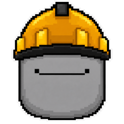

<p align="center">
  
</p>

<h1 align="center">RBLX OPERATOR</h1>

<p align="center">
  <b>One prompt. One complete, balanced, playable Roblox game.</b><br />
  A terminal engine built on top of <b>opencode</b> — the open-source AI coding agent.<br />
  Ships Zombie Rush: Greenwood Siege (a full 10-wave survival shooter) and derives any game you can describe.
</p>

<p align="center">
  <a href="https://github.com/meharbsinghs/RBLX_OPERATOR-/releases/latest/download/rblx-operator-cli.zip"></a>
  <a href="https://github.com/meharbsinghs/RBLX_OPERATOR-/releases/latest/download/rblx-operator-plugin.luau"></a>
  <a href="https://github.com/meharbsinghs/RBLX_OPERATOR-"></a>
</p>

<p align="center">
  <a href="https://github.com/meharbsinghs/RBLX_OPERATOR-/actions"></a>
  <a href="https://github.com/meharbsinghs/RBLX_OPERATOR-/blob/main/LICENSE"></a>
  
</p>

```
                       X:+::X
                  $$**x* ·· *x**$$
                $**X&$$X++++X$$&X**$
               X:X$XXxXXXxxxXXxXX$X+x
              x:XXxX&X*xxxxxx*X&XxXX+x
            $*X*XX*&&X********X&&*XX*X*$
            $+$++:·:...      ...:··++$*X
            +·     ..··········..     ·+
            $x.*xxXXXXXXXXXXXXXXXXxx*.x$
             $·xXX++XXXXXXXXXXXX++XXX·$
             $·xXXXx************xXXXX·$
             $·xXXXXXXXXXXXXXXXXXXXXx·$
             $·xXXXXXXXXXXXXXXXXXXXXx·$
             $·*xXXXXXXXXXXXXXXXXXXx*·$
              x·*xxxXXXXXXXXXXXXxxx*·X
               $*+:+***xxxxxx***+::*$
                  $$XXxxxxxxxxXx$$
```

> **rblx** — the CLI. **rblx-designer** — the opencode agent that designs your game.
> **The engine** — a fixed, typed, server-authoritative Luau runtime. The game is data.
> The prompt is the interface. **It ships games.**

---

## Quick start

Requires [Node.js 18+](https://nodejs.org), [Roblox Studio](https://www.roblox.com/create), and [opencode](https://opencode.ai):

```bash
# 1. The operator (once): opencode — free Zen tier included, any provider works
npm install -g opencode-ai
opencode auth login

# 2. The rblx CLI — download the zip (Releases → rblx-operator-cli.zip) and run setup.bat,
#    or install from source:
npm install -g .
```

Design and ship a game:

```bash
rblx doctor                          # check toolchain: opencode, rojo, Studio, keys
rblx design "a dark zombie survival in a cursed mall, 10 waves"
```

What happens: the **rblx-designer** agent (opencode) derives a complete GameSpec →
the engine compiles it into `src/shared/config.luau` → the verification gate runs →
`rblx build` produces the `.rbxl` → open it in Roblox Studio and press Play.

Zero keys? `rblx newgame --offline "<idea>"` derives entirely offline. No accounts,
no API keys, no .exe, no setup beyond Node.

| Command | What it does |
| --- | --- |
| `rblx banner` | prints the BUILDER BOI ASCII banner |
| `rblx doctor` | toolchain + environment health check |
| `rblx design "<idea>"` | end-to-end design via the opencode rblx-designer agent → spec → config → verify |
| `rblx newgame "<idea>"` | design a full game spec (DeepSeek or offline) and compile it |
| `rblx newgame --spec file.json` | import a spec designed in any AI chat |
| `rblx newgame --offline "<idea>"` | zero-key text derivation |
| `rblx asset "<prompt>"` | Meshy 3D asset → registry (+ Open Cloud upload) |
| `rblx verify` | Luau (`--!strict`) + JS validation gate |
| `rblx build` | verify + Rojo build to a `.rbxl` place |
| `rblx smoke ["<idea>"]` | one-command offline end-to-end proof |
| `rblx operator "<task>"` | engineering loop via opencode (runtime edits, new systems) |
| `rblx fix --log <file>` | crash-log → automated hot-fix loop |
| `rblx newtype "<name>" "<desc>"` | scaffold a new game type (unbounded genres) |

## Built on opencode

RBLX Operator is a thin, opinionated layer on top of the [opencode](https://opencode.ai)
coding agent. Run `opencode` in this repo and you get:

- **`rblx-designer` agent** (`.opencode/agents/rblx-designer.md`) — the design brain.
  The master derivation prompt (`pipeline/system_prompt.md`) is its system prompt;
  it designs any game from a sentence and ships it through the engine.
- **Engine tools** (`.opencode/plugins/rblx-operator.js`) — `rblx_verify`,
  `rblx_compile`, `rblx_build`, `rblx_open` are available to the agent in any session.
- **Any model** — opencode routes to whatever you auth: DeepSeek, Claude, GPT,
  local models, or the **free OpenCode Zen tier**. No lock-in.

```
opencode run --agent rblx-designer "a neon extraction shooter on a derelict space station"
```

## It ships games — not templates

Every prompt produces a complete package: map & waypoint AI graph, lighting mood,
economy (points, perks, mystery box, pack-a-punch, wall buys), up to 6 enemy types
with escalating rounds and boss waves, distinct weapon roles with spring-physics
viewmodel feel, a sound identity (ambience, music tension curve, signature SFX),
data-driven UI, server-authoritative netcode + anti-cheat — and Meshy text-to-3D
assets injected through Roblox Open Cloud.

The repo ships **Zombie Rush: Greenwood Siege** — a complete 10-wave survival
shooter — as the reference game (`examples/` holds more prompts; `games/` holds
specs). `rblx smoke` proves the whole pipeline end-to-end.

## Install options

| Option | How |
| --- | --- |
| zip (recommended) | [rblx-operator-cli.zip](https://github.com/meharbsinghs/RBLX_OPERATOR-/releases/latest/download/rblx-operator-cli.zip) → run `setup.bat` |
| from source | `git clone … && npm install -g .` → `rblx` on your PATH (`npm publish` on the roadmap) |
| Roblox Studio plugin | [rblx-operator-plugin.luau](https://github.com/meharbsinghs/RBLX_OPERATOR-/releases/latest/download/rblx-operator-plugin.luau) — drag into Studio (playtest console, lighting moods, Meshy injection) |
| CLI reference | `rblx doctor` after any install |

## The crew

- **Buffy · Freebuff** — orchestrator. Plans the game, dispatches the designers and
  engineers, verifies, pushes, runs the release loop.
- **opencode** — the operator this system is built on. Runs the rblx-designer agent.
- **rblx-designer** — the opencode agent that turns a sentence into a full GameSpec.
- **DeepSeek** — free-tier design brain (also used by `newgame`).
- **Meshy AI** — text-to-3D assets, auto-uploaded to Roblox via Open Cloud.

## Docs

- [User manual](docs/USER_MANUAL.md) — full CLI guide, Studio setup, playtesting
- [Whitepaper](docs/WHITEPAPER.md) — architecture: game-is-data, the pipeline, the gate
- [GAME_TYPES.md](GAME_TYPES.md) — the unbounded-genre mechanism
- [Studio Craft plugin](plugin/README.md) — the in-Studio playtest & craft surface

## License

MIT — free forever. Fork it, ship your own games, contribute.
